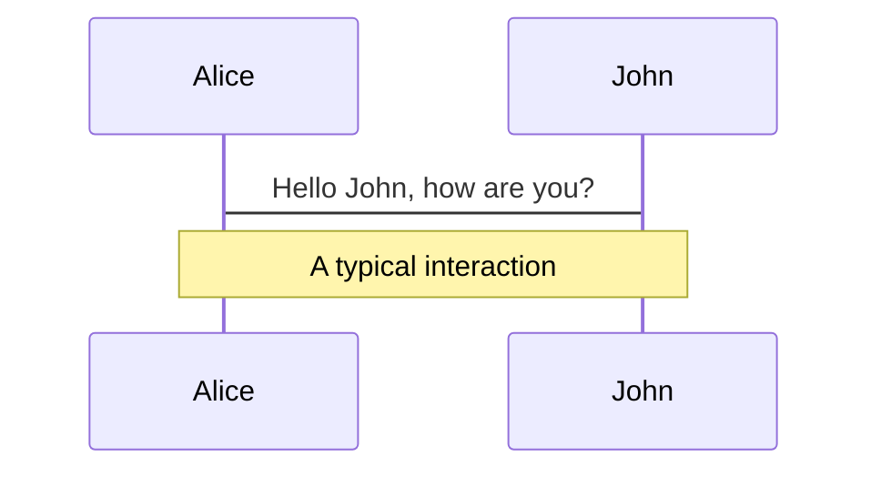
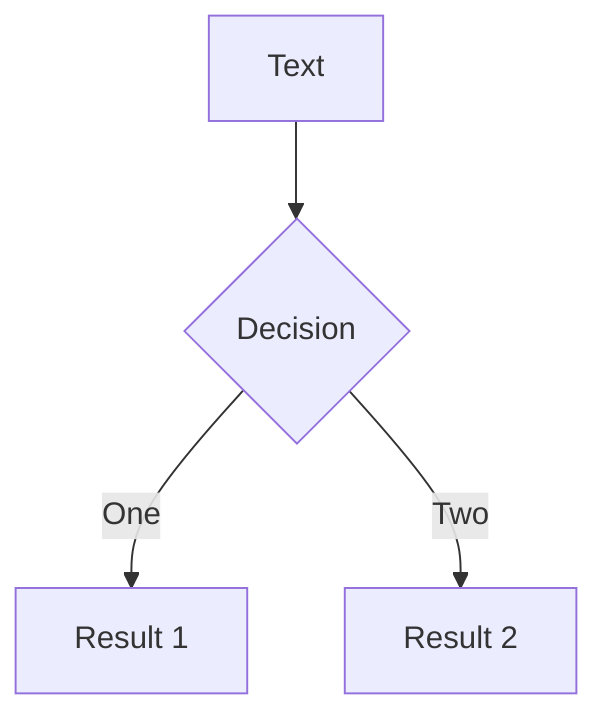

---
# try also 'default' to start simple
# themey: seriph
theme: apple-basic
fonts:
  # basically the text
  sans: 'Robot'
  # use with `font-serif` css class from windicss
  serif: 'Robot Slab'
  # for code blocks, inline code, etc.
  mono: 'Fira Code'
# random image from a curated Unsplash collection by Anthony
# like them? see https://unsplash.com/collections/94734566/slidev
background: https://source.unsplash.com/collection/94734566/1920x1080
# apply any windi css classes to the current slide
class: 'text-center'
# https://sli.dev/custom/highlighters.html
highlighter: shiki
# show line numbers in code blocks
lineNumbers: false
# some information about the slides, markdown enabled
info: |
  ## Slidev Starter Template
  Presentation slides for developers.

  Learn more at [Sli.dev](https://sli.dev)
# persist drawings in exports and build
drawings:
  persist: false
---

# Introduction HTML

<div class="pt-12">
  <span @click="$slidev.nav.next" class="px-2 py-1 rounded cursor-pointer" hover="bg-white bg-opacity-10">
    <carbon:arrow-right class="inline"/>
  </span>
</div>

<div class="abs-br m-6 flex gap-2">
  <button @click="$slidev.nav.openInEditor()" title="Open in Editor" class="text-xl icon-btn opacity-50 !border-none !hover:text-white">
    <carbon:edit />
  </button>
</div>

<!--
The last comment block of each slide will be treated as slide notes. It will be visible and editable in Presenter Mode along with the slide. [Read more in the docs](https://sli.dev/guide/syntax.html#notes)
-->

---

# Qu’est-ce que le html ?

HTML est le langage de balisage pour la création de pages Web.

<br>

- HTML signifie **Hyper Text Markup Language**
- HTML décrit la structure d’une page Web
- HTML se compose d’une série d’éléments
- Les éléments HTML indiquent au navigateur comment afficher le contenu
- Les éléments HTML étiquettent des éléments de contenu tels que
  - « ceci est un titre »
  - « ceci est un paragraphe »
  - « ceci est un lien », etc.

<!--
You can have `style` tag in markdown to override the style for the current page.
Learn more: https://sli.dev/guide/syntax#embedded-styles
-->

---
layout: two-cols
---
# Document HTML

```html
<!DOCTYPE html>
<html>
<head>
<title>Titre de la page</title>
</head>
<body>

<h1>Premier titre</h1>
<p>Mon premier paragraphe</p>

</body>
</html>
```
::right::

<div class="text-sm ml-2">

`<!DOCTYPE html>` définit que ce document est un document HTML5

`<html>` est l’élément racine d’une page HTML

`<head>` contient des méta-informations sur la page HTML

`<title>` spécifie un titre pour la page HTML (qui est affiché dans la barre de titre du navigateur ou dans l’onglet de la page)

`<body>` définit le corps du document, c'est le conteneur pour tous les contenus visibles, tels que  les paragraphes, les images, les liens hypertexte, les tableaux, les
listes, etc.

`<h1>` définit un grand titre

`<p>` définit un paragraphe


</div>

---
layout: image-right
image: https://source.unsplash.com/collection/94734566/1920x1080
---

# Qu’est-ce qu’un élément HTML ?

> Un élément HTML est défini par une balise de début, du contenu et une balise de fin :

```html
<tagname> Le contenu va ici... </tagname>
```

**Exemple:**
```html
<h1> Mon premier titre</h1>
<p> Mon premier paragraphe. </p>
```

**Remarque :**

> Certains éléments HTML n’ont pas de contenu (comme le `<br>`). Ces éléments sont appelés éléments vides. Les éléments vides n’ont pas de balise de fin !

<arrow v-click="3" x1="400" y1="420" x2="230" y2="330" color="#564" width="3" arrowSize="1" />


---

# Navigateurs Web

<div grid="~ cols-2 gap-4">
<div>

<et-browser class="h-90 w-90" />


</div>
<div>

Le but d’un navigateur web (Chrome <logos-chrome />, Edge <logos-microsoft-edge />, Firefox <logos-firefox />, Safari <logos-safari />) est de lire des documents HTML et de les afficher correctement.

> Un navigateur n’affiche pas les balises HTML, mais les utilise pour déterminer comment afficher le document.

</div>
</div>

---

<div grid="~ cols-2 gap-2" m="-t-2">

<div class="text-sm" style="width: 99%; border: 1px solid grey; padding: 3px; margin: 0px; background-color: rgb(221, 221, 221); text-align: start;">
<font _mstmutation="1" _msthash="323856" _msttexthash="69134">&lt;html&gt;
</font><div style="width:90%;border:1px solid grey;padding:3px;margin:20px"><font _mstmutation="1" _msthash="508469" _msttexthash="64675">&lt;head&gt;
</font><div style="width:90%;border:1px solid grey;padding:5px;margin:20px" _msthash="471640" _msttexthash="630812">&lt;title&gt;Titre de la page&lt;/title&gt; </div><font _mstmutation="1" _msthash="508470" _msttexthash="97162"> &lt;/head&gt; </font></div>
<div style="width:90%;border:1px solid grey;padding:3px;margin:20px;background-color:#ddd"><font _mstmutation="1" _msthash="508703" _msttexthash="87997">&lt;body&gt; </font><div style="width:90%;border:1px solid grey;padding:3px;margin:20px;background-color:#fff">
<div style="width:90%;border:1px solid grey;padding:5px;margin:20px" _msthash="689910" _msttexthash="4192279">&lt;h1&gt;Il s’agit d’un titre&lt;/h1&gt;</div>
<div style="width:90%;border:1px solid grey;padding:5px;margin:20px" _msthash="690053" _msttexthash="4161950">&lt;p&gt;Il s’agit d’un paragraphe.&lt;/p&gt;</div>
<div style="width:90%;border:1px solid grey;padding:5px;margin:20px" _msthash="690196" _msttexthash="1952158">&lt;p&gt;C’est un autre paragraphe.&lt;/p&gt;</div>
</div><font _mstmutation="1" _msthash="508704" _msttexthash="100854"> &lt;/body&gt; </font></div><font _mstmutation="1" _msthash="324012" _msttexthash="80509">
&lt;/html&gt;
</font>
</div>

<div>

# Structure d'une Page HTML

**Remarque :**
> Le contenu à l’intérieur de la section `<body>` (la zone blanche) sera affiché dans un navigateur. Le contenu de l'element `<title>` sera affiché dans la barre de titre du navigateur ou dans l’onglet de la page.
</div>
</div>

---

# Éditeurs HTML
Un simple éditeur de texte est tout ce dont vous avez besoin pour apprendre le HTML.


klkl

---
class: px-20
---

# Themes

Slidev comes with powerful theming support. Themes can provide styles, layouts, components, or even configurations for tools. Switching between themes by just **one edit** in your frontmatter:

<div grid="~ cols-2 gap-2" m="-t-2">

```yaml
---
theme: default
---
```

```yaml
---
theme: seriph
---
```


</div>

Read more about [How to use a theme](https://sli.dev/themes/use.html) and
check out the [Awesome Themes Gallery](https://sli.dev/themes/gallery.html).

---
preload: false
---

# Animations

Animations are powered by [@vueuse/motion](https://motion.vueuse.org/).

```html
<div
  v-motion
  :initial="{ x: -80 }"
  :enter="{ x: 0 }">
  Slidev
</div>
```

<div class="w-60 relative mt-6">
  <div class="relative w-40 h-40">
    
    
    
  </div>

  <div
    class="text-5xl absolute top-14 left-40 text-[#2B90B6] -z-1"
    v-motion
    :initial="{ x: -80, opacity: 0}"
    :enter="{ x: 0, opacity: 1, transition: { delay: 2000, duration: 1000 } }">
    Slidev
  </div>
</div>

<!-- vue script setup scripts can be directly used in markdown, and will only affects current page -->
<script setup lang="ts">
const final = {
  x: 0,
  y: 0,
  rotate: 0,
  scale: 1,
  transition: {
    type: 'spring',
    damping: 10,
    stiffness: 20,
    mass: 2
  }
}
</script>

<div
  v-motion
  :initial="{ x:35, y: 40, opacity: 0}"
  :enter="{ y: 0, opacity: 1, transition: { delay: 3500 } }">

[Learn More](https://sli.dev/guide/animations.html#motion)

</div>

---

# LaTeX

LaTeX is supported out-of-box powered by [KaTeX](https://katex.org/).

<br>

Inline $\sqrt{3x-1}+(1+x)^2$

Block
$$
\begin{array}{c}

\nabla \times \vec{\mathbf{B}} -\, \frac1c\, \frac{\partial\vec{\mathbf{E}}}{\partial t} &
= \frac{4\pi}{c}\vec{\mathbf{j}}    \nabla \cdot \vec{\mathbf{E}} & = 4 \pi \rho \\

\nabla \times \vec{\mathbf{E}}\, +\, \frac1c\, \frac{\partial\vec{\mathbf{B}}}{\partial t} & = \vec{\mathbf{0}} \\

\nabla \cdot \vec{\mathbf{B}} & = 0

\end{array}
$$

<br>

[Learn more](https://sli.dev/guide/syntax#latex)

---

# Diagrams

You can create diagrams / graphs from textual descriptions, directly in your Markdown.

<div class="grid grid-cols-2 gap-10 pt-4 -mb-6">





</div>

[Learn More](https://sli.dev/guide/syntax.html#diagrams)


---
layout: center
class: text-center
---

# Learn More

[Documentations](https://sli.dev) · [GitHub](https://github.com/slidevjs/slidev) · [Showcases](https://sli.dev/showcases.html)
